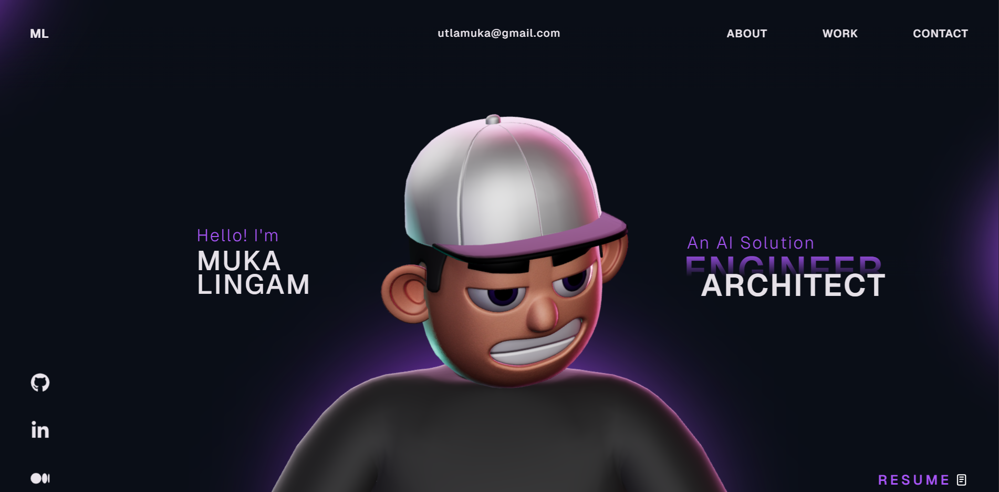

# Muka Lingam — AI Solution Architect Portfolio

A modern, interactive portfolio website showcasing my work as an AI Solution Architect. Built with React, TypeScript, Three.js, and GSAP animations.

**Live Site:** [mukalingam.github.io](https://mukalingam.github.io)



## Tech Stack

- **Frontend:** React, TypeScript, Vite
- **3D Graphics:** Three.js, WebGL
- **Animations:** GSAP (ScrollTrigger, ScrollSmoother, SplitText)
- **Styling:** CSS3 with custom animations
- **Deployment:** GitHub Pages via GitHub Actions

## Features

- Interactive 3D tech stack sphere visualization
- Smooth scroll-driven animations
- Project showcase carousel with 10 AI/ML projects
- Blog section linking to Medium articles
- Career timeline with scroll-based reveal
- Fully responsive design

## Run Locally

```bash
# Clone the repository
git clone https://github.com/mukalingam/mukalingam.github.io.git

# Install dependencies
npm install

# Start development server
npm run dev

# Build for production
npm run build
```

## Projects Featured

- Appify AI — Virtual try-on platform using Stable Diffusion & ControlNet
- AI Chatbot Platform — Multi-model chatbot with RAG pipeline
- Enterprise RAG System — Document intelligence with GPT-4o & LangChain
- MLOps Pipeline — End-to-end ML deployment on AWS/Azure
- NLP Content Moderation — Real-time profanity detection engine
- Computer Vision QC — Defect detection for manufacturing
- Voice AI Assistant — Conversational AI with speech recognition
- Recommendation Engine — Collaborative filtering system
- AI Document Processor — Intelligent OCR & data extraction
- Federated Learning Platform — Privacy-preserving distributed ML

## Blog Topics

Technical articles on AI Agents, LLMs, RAG systems, and enterprise AI — published on [Medium](https://medium.com/@utlamuka).

## License

This project is open source and available under the [MIT License](LICENSE).
